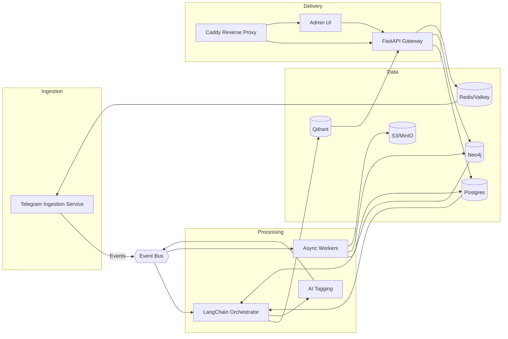

# Архитектурные принципы новой версии Telegram Channel Parser Bot

## 1. Цели и ограничения
- **Сфокусироваться на основном продукте**: стабильный парсинг и обогащение контента каналов Telegram, без вспомогательных сервисов из предыдущей сборки.
- **Минимально достаточная инфраструктура**: запуск без Flowise и других экспериментальных зависимостей, при необходимости масштабирование компонент отдельными контурами. Базовый слой включает Supabase (Postgres + аналитические инструменты), Redis и Caddy.
- **Готовность к развитию**: архитектура должна позволять подключать новые источники данных, модели и способы доставки результатов без переписывания ядра.

## 2. Базовые принципы
1. **Чёткое разделение доменов** — ingestion, прикладной API, обработка/обогащение и аналитика запускаются отдельными сервисами с явными контрактами.
2. **Event-driven** — обмен между сервисами через брокер (Kafka/Redpanda или Redis Streams) и события доменной модели, чтобы не блокировать обработку и упростить масштабирование.
3. **Stateless поверх очередей** — все воркеры и API горизонтально масштабируемы, состояние хранится в Postgres/S3/Redis.
4. **Пакетируемость компонентов** — каждый сервис разворачивается контейнером с собственным lifecycle; локально используется Docker Compose с профилями, в проде — Helm/Ansible.
5. **Богатая модель знаний** — граф Neo4j дополняет реляционные и векторные хранилища, фиксируя связи каналов, сущностей и тем.
6. **Конфигурация как код** — все параметры описываются в Git (Helm values, Terraform, .env.example), никакой “магии” в скриптах.

### 2.1 Почему Neo4j уместен
- **Доменные сценарии**: требуется отслеживать цитирование, перекрестные упоминания, совместные аудитории и тематические цепочки каналов — графовые запросы позволяют выявлять влияние и строить рекомендации.
- **Дополнение к RAG**: структурированный контекст (путь в графе) добавляется к векторному поиску, что улучшает объяснимость и качество ответов; LangChain предоставляет GraphCypherQAChain/GraphRAG, что упрощает внедрение.
- **Потоковая синхронизация**: события обрабатываются в потоках, а обновления графа выполняются идемпотентно; Neo4j выдерживает частые upsert'ы и сложные запросы.
- **Контроль затрат**: граф разворачивается отдельным профилем (например, `graph`), поэтому команды без потребности в аналитике по связям могут не запускать его локально.

## 3. Целевая сервисная топология

### 3.1 Telegram Ingestion Service
- Минимальный сервис на Telethon (или Pyrogram) с единственной задачей — подписка и запись событий в очередь.
- Авторизация пользователей изолирована, сессии хранятся в Postgres + Redis (для fast lookup), без прямых зависимостей от API слоя.
- Поддержка многопользовательского режима за счёт конфигурации пулов аккаунтов (worker-per-user).

### 3.2 LangChain Orchestrator
- Заменяет старые сценарии n8n/Flowise: все пайплайны описаны как LangChain chains/graphs.
- Получает события о новых постах, запускает цепочки обогащения (embeddings, summarization, classification).
- Воркеры выполняют тяжёлые задачи асинхронно (Celery/FastStream/Huey), используя Redis или Redpanda как backend.
- Конвейер построен модульно: добавление новой модели = новый Runnable/Tool.

### 3.3 FastAPI Gateway
- REST и веб-сокет API для управления каналами, запросов RAG, админских операций.
- Авторизация через JWT/Telegram Login Widget; роли (user/admin/support) валидируются посредником.
- Отдельные сервисы: `api-gateway`, `admin-panel` (SPA на Next.js/Vite) и `public-webhook` (для кастомных интеграций).

### 3.4 Edge & Access Layer (Caddy)
- Единый reverse proxy для внешних и внутренних клиентов: маршрутизация API, админ-панели, webhook-эндпоинтов и метрик.
- Центральная точка для TLS, OAuth/OIDC-провайдеров и rate limiting на уровне per-route.
- Интеграция с Grafana/Prometheus dashboards, Supabase Studio и другими административными интерфейсами с SSO.

### 3.5 RAG & AI-сервисы
- **Embeddings**: LangChain + модуль адаптации под выбранного провайдера (OpenAI, GigaChat, локальные LLM через Ollama). Провайдер выбирается конфигурацией.
- **Vector DB**: Qdrant/Weaviate с коллекциями per-tenant, хранение метаданных в Postgres.
- **Generative ответ**: LangChain Runnable, совмещающий retrieval, rerank (если нужно) и финальную генерацию.
- **Tagging**: отдельный воркер, использующий ту же инфраструктуру моделей, что и RAG (общий пул LLM/embedding endpoints).
- **Knowledge Graph**: Neo4j хранит структурированные связи (канал ↔ тема ↔ сущность ↔ событие). Retrieval комбинирует Cypher-запросы и векторный поиск (GraphRAG), что улучшает объяснимость, рекомендации и таргетированные дайджесты.
- **Оценка качества**: LangChain Evaluator Pipeline (например, Ragas) автоматически проверяет ответы по метрикам faithfulness/answer relevance/context precision, фиксируя результаты в Postgres/Neo4j и подсвечивая деградации.

### 3.6 Graph Intelligence Service
- Сервис синхронизации Postgres/Qdrant → Neo4j: выделяет сущности (NER/NEL), строит отношения «упоминание», «источник → репост», «канал ↔ тема».
- Обрабатывает события `EntityLinked`, `RelationshipDetected`, `UserInterestUpdated`, создавая граф знаний.
- Предоставляет API/SDK для выборок путей, вычисления центральности, обнаружения сообществ и формирования персональных рекомендаций.

### 3.7 Data Lake & Analytics
- Сырые сообщения и медиаконтент — в Postgres (Supabase) + S3; преобразованные данные экспортируются в `analytics` схему, при необходимости — в ClickHouse/BigQuery.
- Supabase предоставляет встроенный SQL-редактор, API и row-level security, что упрощает самообслуживание аналитиков и интеграции без прямого доступа к ядру БД.
- Обновление витрин выполняют воркеры через те же LangChain pipelines.
- Графовые витрины (community detection, influencers) рассчитываются в Neo4j и материализуются в Postgres/Supabase для отчётности и API.

## 4. Технологический стек
- **Backend**: Python 3.11+, FastAPI, SQLAlchemy 2.x, LangChain, Pydantic v2, Celery/FastStream.
- **Messaging**: Kafka/Redpanda (прод) или Redis Streams (dev/mid-size).
- **БД**: Postgres (Supabase как управляемая платформа), Redis (кэш/краткоживущие сессии), Qdrant (векторное), Neo4j (граф знаний). MinIO/S3 для файлов.
- **Observability**: OpenTelemetry + Prometheus + Grafana + Loki.
- **CI/CD**: GitHub Actions/GitLab CI, IaC через Terraform/Ansible.

## 5. Управление конфигурацией и секретами
- Pydantic `BaseSettings`/Dynaconf для служб, загрузка из `.env` и секретов (Vault/1Password Secrets Automation).
- Шифрование чувствительных параметров (Telegram API keys, user tokens) с помощью KMS.
- Единая схема версионирования конфигурации (Helm chart + values).

## 6. Жизненный цикл данных
1. **Ingestion**: Telethon пишет событие `MessageCreated` в Redpanda, одновременно сохраняя «сырые» данные в Postgres/Supabase для дальнейшего анализа.
2. **Processing**: LangChain orchestrator обрабатывает события, добавляя задачи в очереди (`embedding`, `tagging`, `digest`).
3. **Storage**: результаты обогащения пишутся в Postgres (структурированные поля), Qdrant (вектора, мета) и Neo4j (связи и графовые признаки).
4. **Delivery**: FastAPI предоставляет API для запросов, админ-панель отображает витрины, пользовательские оповещения уходят через Telegram/Email/Webhook.
5. **Evaluation loop**: LangChain Evaluator (Ragas/LLM-as-a-judge) формирует задания оценки, обновляет метрики качества ответов и сигнализирует о деградациях.
6. **Feedback loop**: события о запросах пользователя (какие ответы полезны) и результаты автооценки публикуются обратно в Redpanda для обучения scoring/ранжирующих моделей.

## 7. Безопасность и мультиарендность
- Разделение арендаторов на уровне БД (tenant_id в таблицах, Row Level Security для Supabase-совместимости).
- Secrets пользователей (API keys) хранятся в зашифрованном виде (PGP/KMS) и расшифровываются только в воркерах.
- RBAC в API (политики на уровне endpoints, отдельный сервис для аудита действий админов).
- Нео4j изолируется отдельным namespace/сетевым сегментом; доступ только через сервис Graph Intelligence, с аудитом Cypher-запросов и политиками Neo4j RBAC.
- Rate limiting: Redis-based leaky bucket для API и телеграм-операций.

## 8. Наблюдаемость и эксплуатация
- Стандартизированные health-checks (`/healthz`, `/readyz`) для каждого сервиса.
- Прозрачная трассировка: каждый event снабжается `trace_id`, которые прокидываются через все компоненты (OTel propagators).
- Dashboards: ingestion lag, очереди LangChain, ошибки LLM провайдеров, latency API, метрики Neo4j (количество узлов/рёбер, время выполнения Cypher) и качество RAG (Ragas scores, дрейф ответов).
- Авто-скейлинг воркеров по метрике lag (HPA/KEDA).

### 8.1 Контур оценки качества
- **Evaluator Service**: отдельный воркер, который по расписанию или после релизов прогоняет контрольные запросы и оценивает ответы (Ragas, pairwise LLM оценка).
- **Метрики и алерты**: результаты сохраняются в Postgres/Neo4j, агрегированные показатели экспортируются в Prometheus (например, `ragas_faithfulness_score`). Настраиваются алерты на деградацию качества.
- **Human-in-the-loop**: при падении метрик формируется задача на ручную проверку, аналитики обновляют эталонные ответы или корректируют цепочки LangChain.

## 9. Стратегия развёртывания
- **Dev**: Docker Compose с профилями `core`, `rag`, `analytics`. По умолчанию запускается только `core` (ingestion + API + Postgres/Supabase локальный, Redis).
- **Stage/Prod**: Kubernetes/Ansible — каждый сервис в отдельном deployment; общий ingress (Caddy/Traefik), сервисные аккаунты, NetworkPolicies. Caddy выступает точкой входа для внешних клиентов, Supabase подключается как управляемое окружение для БД/аналитики.
- **Миграции**: Alembic + автогенерация; для LangChain пайплайнов — versioned YAML с описанием graph.

## 10. Roadmap реализации
1. **Инициализация ядра**: Telethon ingestion + FastAPI + Postgres + Redis (без LangChain).
2. **Добавление orchestrator**: внедрить Redpanda/Redis Streams, выделить LangChain сервис и воркеры.
3. **RAG модуль**: подключить Qdrant, настроить LangChain retrieval pipeline, реализовать API.
4. **Graph Intelligence**: развернуть Neo4j, внедрить сервис синхронизации, реализовать GraphRAG/рекомендации.
5. **Quality Evaluation**: развернуть evaluator-пайплайн (Ragas), подключить контрольные датасеты и вывести метрики в мониторинг/Grafana.
6. **Tagging & Analytics**: добавить LLM-based tagging, экспорт витрин, интеграцию с Supabase и внешними BI.
7. **Observability & Security**: ввести OTel, централизованное управление секретами, RBAC и аудит. Настроить Grafana dashboards и Caddy-основанную аутентификацию к административным интерфейсам.

---

Этот документ фиксирует фундаментальную архитектуру новой версии, исключает Flowise и другие неиспользуемые элементы, и закладывает основу для последовательного развития продукта вокруг LangChain и ядра Telegram-парсера.
