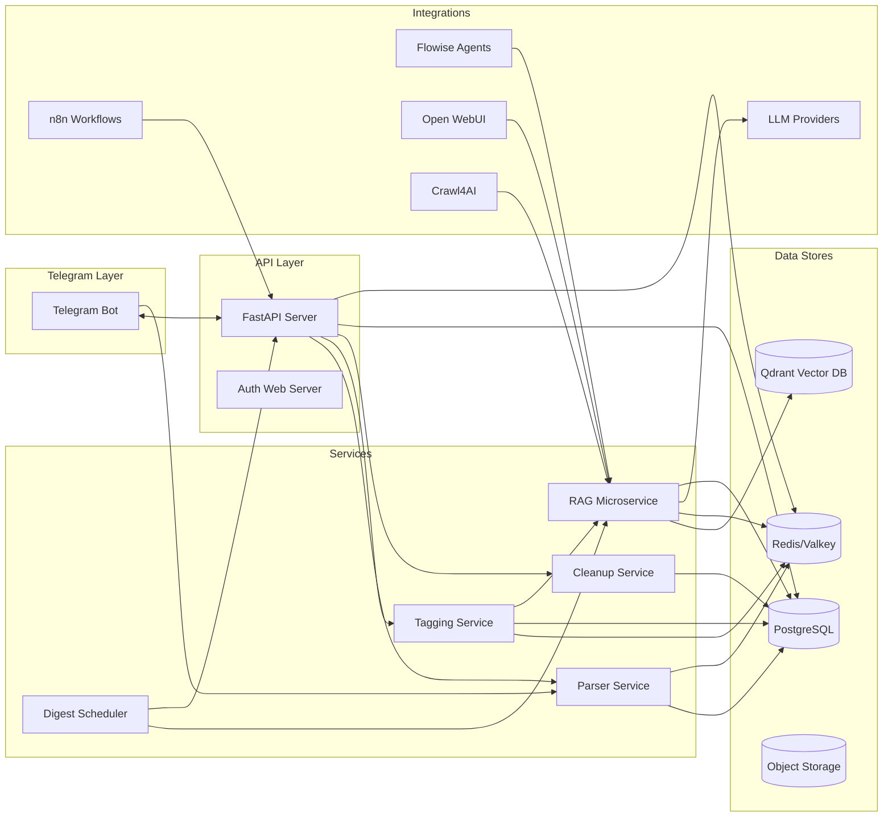
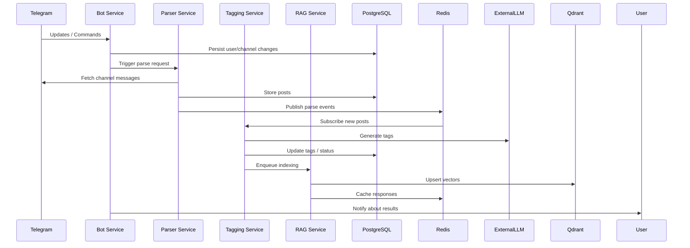
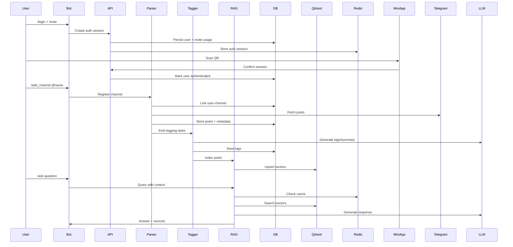
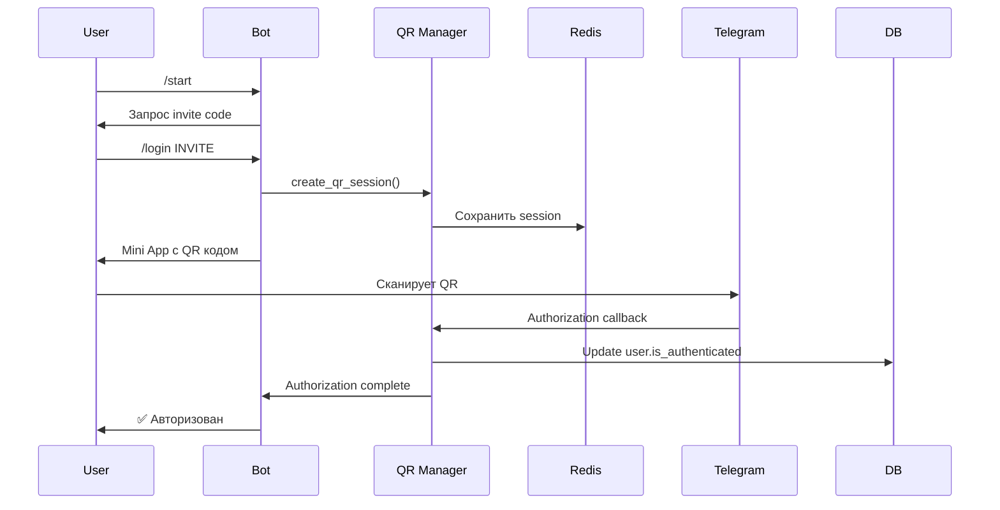
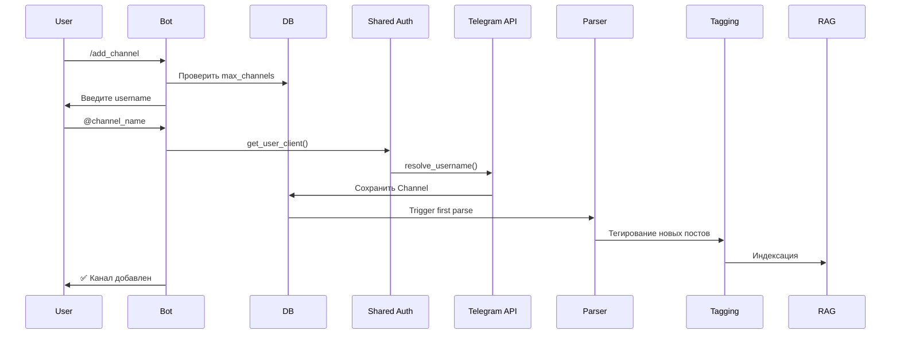
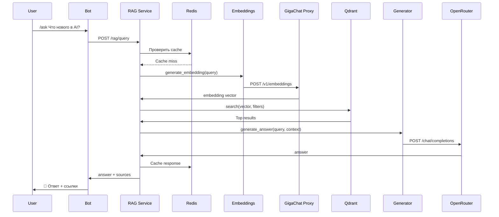
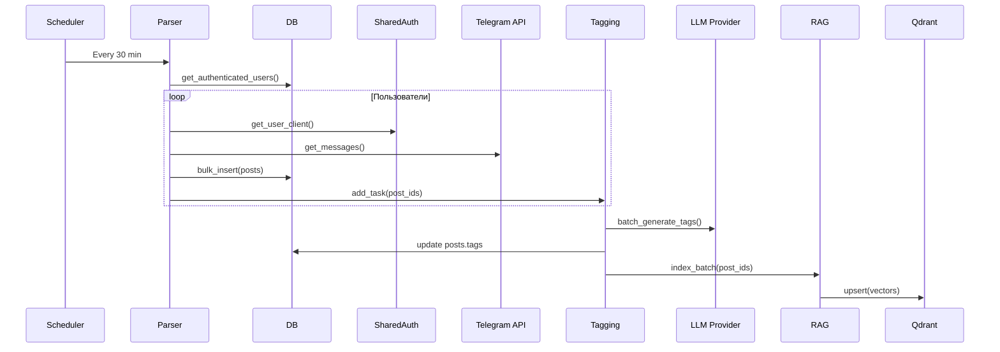
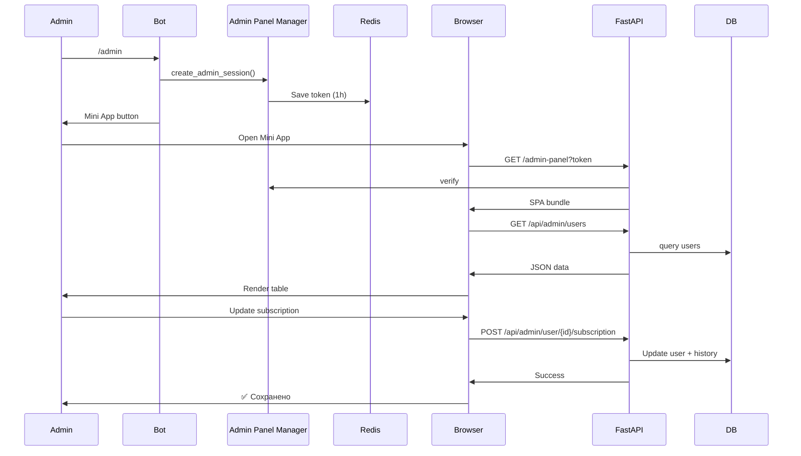

# Telegram Channel Parser Bot — System Specification

> Полная спецификация текущей версии многокомпонентной системы парсинга Telegram-каналов, интеграций с n8n и сервисов RAG/AI.

## Содержание
- [1. Обзор системы](#1-обзор-системы)
- [2. Архитектура системы](#2-архитектура-системы)
  - [2.1 Общая архитектура](#21-общая-архитектура)
  - [2.2 Event-Driven Architecture](#22-event-driven-architecture)
  - [2.3 Data Flow](#23-data-flow)
- [3. Компоненты системы](#3-компоненты-системы)
  - [3.1 Telegram Bot Service](#31-telegram-bot-service)
  - [3.2 FastAPI Server](#32-fastapi-server)
  - [3.3 Parser Service](#33-parser-service)
  - [3.4 RAG Service](#34-rag-service)
  - [3.5 Auth System](#35-auth-system)
  - [3.6 Subscription & Roles System](#36-subscription--roles-system)
  - [3.7 Tagging Service](#37-tagging-service)
  - [3.8 Cleanup Service](#38-cleanup-service)
- [4. База данных](#4-база-данных)
  - [4.1 Схема БД](#41-схема-бд)
  - [4.2 PostgreSQL](#42-postgresql)
  - [4.3 Redis/Valkey](#43-redisvalkey)
  - [4.4 Qdrant](#44-qdrant)
- [5. Интеграции](#5-интеграции)
  - [5.1 Внутренние сервисы](#51-внутренние-сервисы)
  - [5.2 Внешние сервисы](#52-внешние-сервисы)
  - [5.3 Webhooks](#53-webhooks)
- [6. Deployment](#6-deployment)
  - [6.1 Docker Architecture](#61-docker-architecture)
  - [6.2 Build Process](#62-build-process)
  - [6.3 Production Deployment](#63-production-deployment)
  - [6.4 Scaling Strategies](#64-scaling-strategies)
- [7. Пайплайн работы системы](#7-пайплайн-работы-системы)
  - [7.1 User Journey: Регистрация](#71-user-journey-регистрация)
  - [7.2 User Journey: Добавление канала](#72-user-journey-добавление-канала)
  - [7.3 User Journey: RAG запрос](#73-user-journey-rag-запрос)
  - [7.4 Background Process: Парсинг](#74-background-process-парсинг)
  - [7.5 Admin Process: Управление пользователями](#75-admin-process-управление-пользователями)
- [8. Мониторинг и Observability](#8-мониторинг-и-observability)
  - [8.1 Метрики](#81-метрики)
  - [8.2 Логирование](#82-логирование)
  - [8.3 Tracing](#83-tracing)
  - [8.4 Health Checks](#84-health-checks)
- [9. Security](#9-security)
  - [9.1 Authentication](#91-authentication)
  - [9.2 Authorization](#92-authorization)
  - [9.3 Data Protection](#93-data-protection)
  - [9.4 Security Best Practices](#94-security-best-practices)
- [10. Performance & Optimization](#10-performance--optimization)
  - [10.1 Database Optimization](#101-database-optimization)
  - [10.2 Caching Strategies](#102-caching-strategies)
  - [10.3 Async Everywhere](#103-async-everywhere)
  - [10.4 Resource Limits](#104-resource-limits)
- [11. Testing](#11-testing)
  - [11.1 Unit Tests](#111-unit-tests)
  - [11.2 Integration Tests](#112-integration-tests)
  - [11.3 Load Testing](#113-load-testing)
- [12. Troubleshooting](#12-troubleshooting)
  - [12.1 Типичные проблемы](#121-типичные-проблемы)
  - [12.2 Debugging](#122-debugging)
  - [12.3 Recovery Procedures](#123-recovery-procedures)
- [13. Migration & Upgrades](#13-migration--upgrades)
  - [13.1 Database Migrations](#131-database-migrations)
  - [13.2 Version Upgrades](#132-version-upgrades)
- [14. API Reference](#14-api-reference)
  - [14.1 Main API (FastAPI)](#141-main-api-fastapi)
  - [14.2 RAG Service API](#142-rag-service-api)
  - [14.3 Bot Commands](#143-bot-commands)
- [15. Code Examples](#15-code-examples)
  - [15.1 Client Integration](#151-client-integration)
  - [15.2 n8n Workflows](#152-n8n-workflows)
  - [15.3 Custom Extensions](#153-custom-extensions)
- [16. Appendix](#16-appendix)
  - [16.1 Glossary](#161-glossary)
  - [16.2 References](#162-references)
  - [16.3 Contact & Support](#163-contact--support)

---

## 1. Обзор системы

**Назначение.** Telegram Channel Parser Bot — многокомпонентная система, объединяющая Telegram-бота, REST API, сервисы фоновой обработки и RAG-подсистему для сбора, анализа и доставки контента из Telegram-каналов. Основная цель — предоставить пользователям управляемый сервис подписки на каналы, с гибкой авторизацией, AI-тегированием и глубокой интеграцией в n8n-экосистему.

**Ключевые возможности.**
- Многопользовательская работа с персональными Telegram-сессиями и каналами.
- Управление через Telegram-бота, веб-API и административные mini-app интерфейсы.
- Автоматический парсинг, хранение и обогащение контента.
- Векторный поиск, генерация ответов и дайджестов на базе RAG.
- Расширяемая система подписок, лимитов и инвайтов.
- Интеграция с внешними AI/LLM-провайдерами и автоматизация через n8n.

**Технологический стек.**
- **Python 3.11** (FastAPI, Telethon, SQLAlchemy, Pydantic, Celery/FastStream-подобные очереди).
- **PostgreSQL / SQLite** (в разработке), **Redis**, **Qdrant**.
- **Docker Compose** с дополнительными сервисами: Caddy, Supabase, Flowise, Open WebUI, Grafana, Prometheus, n8n, SearXNG, Crawl4AI, Ollama и др.
- **LLM/AI интеграции**: GigaChat, OpenRouter, OpenAI совместимые API, локальные модели через Ollama.

**Архитектурные решения.**
- Модульная архитектура: отдельные сервисы для бота, API, парсинга, тегирования, RAG и обслуживания.
- Асинхронная обработка событий Telegram и фоновых задач.
- Чёткая доменная модель (пользователи, каналы, посты, подписки, дайджесты, истории запросов).
- Использование шифрования для хранения чувствительных данных (API hash, номера телефонов).
- Возможность динамического расширения за счёт Docker-профилей и дополнительных микросервисов.

## 2. Архитектура системы

### 2.1 Общая архитектура



**Микросервисная структура.** Хотя проект развёрнут внутри одного репозитория, логически выделены независимые сервисы, которые можно запускать в отдельных контейнерах: бот, API, парсер, RAG, тегирование, очистка, планировщик дайджестов, веб-сервер авторизации.

**Взаимодействие сервисов.** Бот и API обращаются к общим доменным сервисам (auth, parser, tagging). Фоновые задачи выполняются отдельными воркерами. RAG-сервис взаимодействует с общими моделями и БД, но имеет собственный конфигурационный слой.

### 2.2 Event-Driven Architecture



**Обработка событий Telegram.** Telethon получает обновления, которые преобразуются в команды или фоновые задания. Команды пользователя влияют на состояние в БД, а парсинг запускается по расписанию или вручную.

**Асинхронная обработка.** Парсер и теггер используют asyncio и фоновые задачи FastAPI для запуска индексации, что позволяет не блокировать основной цикл и распределять нагрузку между сервисами.

### 2.3 Data Flow



---

## 3. Компоненты системы

### 3.1 Telegram Bot Service

**Основные файлы:** `bot.py`, `bot_admin_handlers.py`, `bot_login_handlers_qr.py`, `bot_debug.py`, `bot_debug_commands.py`.

**Архитектура.**
- Использует Telethon для работы с Telegram Bot API и клиентскими сессиями.
- Реализует ConversationHandler-подобную логику через state-machine в Python: состояния регистрации, добавления каналов, управления подписками и дайджестами.
- Имеет отдельные хэндлеры для пользователей и администраторов.

**Ключевые команды пользователя.**
- `/start`, `/help` — онбординг и справка.
- `/login` — инициирует QR-авторизацию.
- `/add_channel`, `/remove_channel`, `/list_channels` — управление каналами.
- `/ask`, `/digest`, `/settings` — работа с RAG и дайджестами.
- `/logout` — отключение Telegram-сессии.

**Админские команды.**
- `/admin` — выдаёт ссылку на mini-app панель.
- `/invite`, `/invites` — управление инвайтами.
- `/users`, `/subscription` — контроль подписок и ролей.

**QR-авторизация через Mini App.**
- Генерирует временный `auth_session_id`, сохраняет в Redis, отправляет ссылку на mini-app.
- Пользователь сканирует QR из mini-app, авторизация завершается callback-ом в Auth Web Server.

**Примеры кода.**
- Работа с secure auth: `secure_auth_manager.py` предоставляет интерфейс для выдачи клиентских сессий, включая шифрование и маскирование данных.
- Интеграция с API: бот вызывает REST-эндпоинты FastAPI для парсинга и запросов к RAG.

### 3.2 FastAPI Server

**Файл:** `main.py`.

**Ответственность.**
- REST API для управления пользователями, каналами, парсингом, подписками и дайджестами.
- Запуск миграций и инициализация таблиц при старте (`create_tables()`).
- Обработка фоновых задач через `BackgroundTasks`.

**Ключевые эндпоинты.**
- `GET /users`, `GET /users/{id}` — управление пользователями.
- `POST /users/{id}/logout`, `GET /users/{id}/auth_status` — контроль авторизации.
- `GET /users/{telegram_id}/channels`, `POST /users/{id}/channels` — управление каналами.
- `POST /users/{id}/channels/parse` — инициировать парсинг для конкретного пользователя.
- `POST /retention/settings` — настройки retention и запуск очистки.
- `POST /rag/query`, `POST /rag/digest` — проксирование запросов в RAG-сервис.

**Зависимости.**
- `auth.py` — функции `get_user_client`, `check_user_auth_status`, `logout_user`, `disconnect_all_clients`.
- `ParserService` — запуск парсинга и планировщика.
- БД-сессии через `database.py` и `SessionLocal`.

### 3.3 Parser Service

**Файл:** `parser_service.py`.

**Назначение.**
- Регулярно парсит подписанные каналы пользователей.
- Обрабатывает FloodWait, ограничения Telegram и ведёт ретраи.
- Обогащает посты (ссылки, вложения) и формирует события для тегирования и RAG.

**Особенности.**
- Многопользовательская поддержка: парсинг запускается для каждого авторизованного пользователя отдельно.
- Исполняет батчи сообщений, контролирует лимиты по подпискам и количеству каналов.
- Сохраняет в таблице `user_channel.last_parsed_at` для контроля расписания.

### 3.4 RAG Service

**Директория:** `telethon/rag_service/`.

**Архитектура.**
- Отдельное FastAPI-приложение (`main.py`) со слоями для индексирования (`indexer.py`), векторной БД (`vector_db.py`), генерации эмбеддингов (`embeddings.py`), поиска (`search.py`), генерации ответов (`generator.py`) и дайджестов (`digest_generator.py`).
- Настройки в `config.py`, схемы в `schemas.py`.
- Планировщик дайджестов `scheduler.py` запускает APScheduler и восстанавливает расписания из БД при старте.

**API-эндпоинты.**
- `POST /rag/index/post/{post_id}` — индексировать единичный пост.
- `POST /rag/index/batch` — индексировать батч постов.
- `GET /rag/index/status/{user_id}` — получить статус индексации.
- `POST /rag/query` — векторный поиск с генерацией ответа.
- `POST /rag/digest` — сформировать дайджест.
- `GET /rag/collections/{user_id}` — статистика по коллекциям пользователя.

**Алгоритмы.**
- **Hybrid search**: комбинация векторного поиска и метаданных (фильтры по каналам, тегам, времени).
- **Re-ranking**: повторная сортировка по релевантности и качеству текста.
- **Context assembly**: объединение лучших постов, сегментация на чанки, подача в LLM через prompt-шаблоны.

**Интеграции.**
- `embeddings_service` может использовать GigaChat через `gpt2giga-proxy` или альтернативные провайдеры.
- `generator` поддерживает OpenRouter, локальные модели (Ollama) и fallback-цепочки.
- `digest_generator` использует сохранённые `DigestSettings` для персонализации.

### 3.5 Auth System

**Файлы:** `auth.py`, `secure_auth_manager.py`, `shared_auth_manager.py`, `qr_auth_manager.py`, `auth_web_server.py`.

**QR Login через Mini App.**
- `qr_auth_manager.py` создаёт сессии в Redis, выдаёт mini-app URL, отслеживает статус.
- `auth_web_server.py` — отдельное FastAPI-приложение, принимающее callback от Telegram и завершающее авторизацию.

**Shared Auth Manager.**
- `shared_auth_manager.py` управляет мастер-сессиями, хранит master API credentials, раздаёт Telethon-клиенты для пользователей.

**Secure Auth Manager.**
- `secure_auth_manager.py` оборачивает работу с Telegram API, шифрует личные данные и выдаёт безопасные клиенты через менеджер контекста.

**Session management.**
- Redis хранит временные токены, попытки авторизации и блокировки.
- В БД сохраняются `auth_session_id`, `auth_session_expires`, `failed_auth_attempts`, `block_expires`.

### 3.6 Subscription & Roles System

**Файлы:** `subscription_config.py`, `models.py` (поля `subscription_type`, `max_channels`, `SubscriptionHistory`), бот-хэндлеры.

**Тарифные планы.**
- Конфигурация лимитов (`SUBSCRIPTION_TIERS`) определяет максимальное количество каналов, опции RAG/AI, доступ к дайджестам и т.п.
- Invite codes назначают дефолтный тариф и пробный период.

**Invite codes.**
- Таблица `invite_codes` хранит код, создателя, количество использований, срок действия и параметры trial.
- Бот предоставляет админам команды для создания и выдачи инвайтов.

**Лимиты.**
- `User.can_add_channel()` проверяет активность подписки и текущее количество каналов.
- Парсер учитывает лимиты при запуске задач.

### 3.7 Tagging Service

**Файл:** `tagging_service.py`.

**Назначение.**
- Автоматическое AI-тегирование постов после парсинга.
- Поддерживает batch-обработку, ретраи, статусы (`pending`, `retrying`, `failed`, `success`).

**Провайдеры.**
- OpenRouter (LLM API) по умолчанию.
- Поддержка нескольких моделей и fallback-цепочек при ошибках.

**Интеграции.**
- После успешного тегирования инициирует индексирование в RAG (`index_batch`).
- Сохраняет enriched content для RAG (обогащение ссылок через Crawl4AI).

### 3.8 Cleanup Service

**Файл:** `cleanup_service.py`.

**Функциональность.**
- Управление retention политикой — удаление постов старше `retention_days` каждого пользователя.
- Поддерживает ручной запуск через API (`run_cleanup_immediately`).
- Ведёт логи и статистику по удалённым постам.

---

## 4. База данных

### 4.1 Схема БД

```mermaid
erDiagram
    User ||--o{ Post : "creates"
    User ||--o{ RAGQueryHistory : "logs"
    User ||--|| DigestSettings : "has"
    User ||--o{ SubscriptionHistory : "changes"
    User ||--o{ InviteCode : "creates"
    User ||--o{ InviteCode : "uses"
    User ||--o{ IndexingStatus : "owns"
    User ||--o{ user_channel : "subscribes"
    Channel ||--o{ Post : "contains"
    Channel ||--o{ user_channel : "subscribed"
    Post ||--o{ IndexingStatus : "indexed"
    Post ||--o{ Tagging : "tagged" %% логическая связь
    user_channel }o--o{ Channel : "links"
```

**Таблицы.**
- `users` — основная сущность пользователя; хранит Telegram ID, персональные данные, настройки retention, подписки, роли.
- `channels` — Telegram-каналы, связанные с несколькими пользователями через таблицу `user_channel`.
- `user_channel` — связь многие-ко-многим с полями активности и времени последнего парсинга.
- `posts` — сообщения каналов с тегами, enriched content и статусами тегирования.
- `digest_settings` — настройки рассылки дайджестов.
- `indexing_status` — статус индексации постов в RAG.
- `rag_query_history` — история пользовательских запросов.
- `invite_codes` — инвайт-коды с метаданными.
- `subscription_history` — аудиторский лог изменений тарифов.

### 4.2 PostgreSQL

- Основное хранилище (в проде через Supabase или standalone Postgres).
- Используются timezone-aware поля (`datetime.now(timezone.utc)`).
- Поддерживаются индексы по ключевым полям (user_id, channel_id, status).
- Рекомендуется настроить connection pooling (PgBouncer) для многопользовательской нагрузки.

### 4.3 Redis/Valkey

- Используется для хранения сессий авторизации, кеширования RAG-ответов, счётчиков ретраев и очередей фоновых задач.
- TTL на токены авторизации, ограничения rate-limiting, хранение digest jobs.

### 4.4 Qdrant

- Векторное хранилище для постов с персональными коллекциями на пользователя.
- Настройки HNSW и payload-фильтры позволяют ограничивать поиск по каналам/тегам/датам.
- Поддерживается резервное копирование и восстановление коллекций.

---

## 5. Интеграции

### 5.1 Внутренние сервисы

- **gpt2giga-proxy** — прокси GigaChat → OpenAI API для единого интерфейса.
- **Ollama** — локальное развёртывание LLM для приватных данных.
- **Telegram Mini Apps** — веб-приложения для QR авторизации и админ-панели.

### 5.2 Внешние сервисы

- **OpenRouter** — мульти-провайдер LLM API.
- **SearXNG** — метапоиск для расширения контекста RAG.
- **Crawl4AI** — скрапинг ссылок и генерация enriched content.
- **Flowise** / **n8n** — автоматизация и визуальные агенты.

### 5.3 Webhooks

- Отправка событий в n8n (например, новые посты, результаты дайджестов).
- Пайплайны обработки можно расширять через REST API или Webhook nodes.

---

## 6. Deployment

### 6.1 Docker Architecture

- Корневой `docker-compose.yml` описывает базовые сервисы (Caddy, Postgres, Redis, n8n) и опциональные профили (Flowise, Qdrant, Supabase и др.).
- `docker-compose.override.yml` и `start_services.py` позволяют выбирать наборы сервисов для запуска.
- Внутренние сети (`localai_default` и др.) организуют защищённый обмен между контейнерами.

### 6.2 Build Process

- `telethon/Dockerfile.telethon` — multi-stage сборка Python-сервиса (установка зависимостей, компиляция wheels, копирование кода).
- `telethon/rag_service/Dockerfile.rag` — отдельный образ для RAG-сервиса.
- Используются `requirements.txt` с фиксированными версиями.

### 6.3 Production Deployment

- **Caddy** выполняет reverse proxy и автоматическую выдачу TLS-сертификатов.
- Каждый сервис мапится на поддомен (`n8n.domain.com`, `rag.domain.com`).
- Health-check endpoints (`/health`) используются для мониторинга доступности.

### 6.4 Scaling Strategies

- Горизонтальное масштабирование RAG-сервиса (несколько воркеров, общий Redis/Qdrant).
- Read replicas для Postgres, если количество чтений велико.
- Redis Cluster для масштабирования кеша и брокера.
- Балансировка нагрузки через Caddy/Traefik/Nginx или внешние решения.

---

## 7. Пайплайн работы системы

### 7.1 User Journey: Регистрация



### 7.2 User Journey: Добавление канала



### 7.3 User Journey: RAG запрос



### 7.4 Background Process: Парсинг



### 7.5 Admin Process: Управление пользователями



---

## 8. Мониторинг и Observability

### 8.1 Метрики

- Prometheus собирает метрики из FastAPI и RAG (`/metrics`).
- Основные показатели: количество обработанных постов, время ответа RAG, количество ошибок авторизации, utilisation очередей.
- Grafana дашборды для мониторинга Telegram-парсинга, активности пользователей и нагрузки на LLM-провайдеров.

### 8.2 Логирование

- Структурированные логи через стандартный модуль `logging` с префиксами и уровнями.
- Разделение логов по сервисам (bot, parser, rag, auth).
- Ротация логов на уровне Docker volume или внешнего агрегатора (Loki).

### 8.3 Tracing

- Планируется интеграция с OpenTelemetry; в текущей версии доступны correlation IDs в логах.
- RAG-сервис логирует этапы обработки (поиск, генерация, кеширование).

### 8.4 Health Checks

- FastAPI: `GET /health` — проверка подключения к БД и Redis.
- RAG: `GET /health` — проверяет Qdrant, GigaChat, OpenRouter.
- Caddy/Prometheus снимают эти данные для алертинга.

---

## 9. Security

### 9.1 Authentication

- QR Login через mini-app: временные токены, подтверждение через Telegram.
- Поддержка альтернативной авторизации через OAuth веб-форму (`auth_web_server.py`).
- Блокировка аккаунта после нескольких неудачных попыток (`failed_auth_attempts`).

### 9.2 Authorization

- Ролевая модель (`role`: `admin`, `user`).
- Ограничения по подпискам (лимит каналов, доступ к RAG, дайджестам).
- Админ-панель доступна только пользователям с ролью `admin`.

### 9.3 Data Protection

- Шифрование чувствительных полей (`api_hash`, `phone_number`) через `crypto_utils.py`.
- Маскирование данных в логах (`get_masked_phone_number`).
- TLS-терминация Caddy, использование HTTPS для внешних сервисов.

### 9.4 Security Best Practices

- Валидация ввода на всех уровнях (Pydantic схемы, проверка invite codes).
- Ограничение доступа к административным endpoint-ам.
- Регулярное обновление зависимостей и контейнеров.

---

## 10. Performance & Optimization

### 10.1 Database Optimization

- Индексы на `posts(telegram_message_id)`, `user_channel(last_parsed_at)`, `indexing_status(status)`.
- Batch-вставки постов и обновления статусов.
- Пулы соединений через SQLAlchemy.

### 10.2 Caching Strategies

- Redis: кеширование RAG ответов (1 час), embeddings (24 часа), токены авторизации.
- Возможность кешировать результаты поиска и дайджестов.

### 10.3 Async Everywhere

- Использование asyncio и асинхронных клиентов (Telethon, HTTPX) в ботах и сервисах.
- Фоновые задачи FastAPI (`BackgroundTasks`) для индексации.

### 10.4 Resource Limits

- Ограничения Telegram API соблюдаются через контроль частоты запросов и FloodWait обработку.
- Docker ресурсы (CPU/memory limits) для тяжелых сервисов (Flowise, Ollama, RAG).

---

## 11. Testing

### 11.1 Unit Tests

- `telethon/tests/` содержит юнит-тесты моделей и вспомогательных функций (pytest).
- Используются фикстуры для временных БД и mock Telegram API.

### 11.2 Integration Tests

- Планируется расширение: запуск FastAPI + RAG + Postgres в docker-compose для сквозных сценариев.
- Smoke-тесты для Telegram бота через тестовые аккаунты.

### 11.3 Load Testing

- Рекомендованные инструменты: k6 для REST API, Locust для RAG запросов.
- Контроль производительности LLM и Qdrant под нагрузкой.

---

## 12. Troubleshooting

### 12.1 Типичные проблемы

- QR Login не завершает авторизацию — проверить Redis и callback URL.
- Парсинг падает из-за FloodWait — проверить логи `parser_service`, увеличить задержки.
- RAG не отвечает — убедиться в доступности Qdrant и API ключей LLM.
- Админ-панель не загружается — проверить токен в Redis и роль пользователя.

### 12.2 Debugging

- Основные команды: `docker compose logs <service>`, `python bot_debug.py`.
- Redis CLI для проверки сессий и токенов.
- Qdrant REST API для просмотра коллекций.

### 12.3 Recovery Procedures

- Восстановление базы: резервные копии Postgres, миграции Alembic (планируется).
- Пересборка коллекций Qdrant: повторное индексирование через `/rag/index/batch`.
- Восстановление Telegram-сессий: повторная авторизация через QR.

---

## 13. Migration & Upgrades

### 13.1 Database Migrations

- Скрипты в `telethon/scripts/migrations/` (например, `add_rag_tables.py`).
- Пошаговый подход: остановка сервисов, бэкап БД, запуск миграции, smoke-тесты.
- Планируется переход на Alembic для управляемых миграций.

### 13.2 Version Upgrades

- Обновления зависимостей через `pip-compile` или обновление `requirements.txt`.
- Docker-образы пересобираются скриптом `scripts/update.sh` (из корня проекта).
- Changelog вести в `docs/` или Release Notes репозитория.

---

## 14. API Reference

### 14.1 Main API (FastAPI)

| Метод | Endpoint | Описание |
|-------|----------|----------|
| GET | `/users` | Список пользователей с фильтрами `authenticated_only`, `active_only` |
| GET | `/users/{user_id}/auth_status` | Статус авторизации пользователя |
| POST | `/users/{user_id}/logout` | Принудительный выход пользователя |
| GET | `/users/{telegram_id}/channels` | Список каналов пользователя |
| POST | `/users/{user_id}/channels/parse` | Запуск парсинга для пользователя |
| POST | `/retention/settings` | Обновление retention и запуск очистки |
| POST | `/rag/query` | Проксирование RAG-запроса |
| POST | `/rag/digest` | Запрос на формирование дайджеста |
| GET | `/health` | Проверка статуса сервиса |

**Примеры curl:**
```bash
curl -X GET "http://localhost:8010/users?authenticated_only=true"

curl -X POST "http://localhost:8010/users/1/channels/parse" \
     -H "Content-Type: application/json" \
     -d '{"force": true}'
```

### 14.2 RAG Service API

| Метод | Endpoint | Описание |
|-------|----------|----------|
| POST | `/rag/index/post/{post_id}` | Индексация отдельного поста |
| POST | `/rag/index/batch` | Индексация списка постов |
| GET | `/rag/index/status/{user_id}` | История индексации |
| GET | `/rag/collections/{user_id}` | Статистика коллекции |
| POST | `/rag/query` | Поиск и генерация ответа |
| POST | `/rag/digest` | Формирование дайджеста |
| GET | `/health` | Проверка состояния RAG |

**Пример запроса:**
```bash
curl -X POST "http://localhost:8020/rag/query" \
     -H "Content-Type: application/json" \
     -d '{
          "user_id": 1,
          "query": "Сводка по AI новостям",
          "filters": {"channels": ["ai_news"], "date_from": "2024-01-01"},
          "llm": {"provider": "openrouter", "model": "anthropic/claude-3"}
        }'
```

### 14.3 Bot Commands

| Команда | Описание |
|---------|----------|
| `/start`, `/help` | онбординг и справка |
| `/login`, `/logout` | управление авторизацией |
| `/add_channel`, `/remove_channel`, `/list_channels` | каналы |
| `/ask`, `/search`, `/digest` | RAG-запросы и дайджесты |
| `/settings`, `/retention` | пользовательские настройки |
| `/admin`, `/invite`, `/users` | админ-функции |

---

## 15. Code Examples

### 15.1 Client Integration

**Python SDK (через requests).**
```python
import requests

BASE_URL = "http://localhost:8010"

resp = requests.get(f"{BASE_URL}/users", params={"authenticated_only": True})
resp.raise_for_status()
users = resp.json()["users"]

parse_resp = requests.post(f"{BASE_URL}/users/{users[0]['id']}/channels/parse")
print(parse_resp.json())
```

### 15.2 n8n Workflows

- `telethon/examples/` содержит JSON workflow для интеграции с n8n.
- Пример: автоматический запуск `/rag/query` по расписанию и отправка результата в Slack.

### 15.3 Custom Extensions

- Добавление нового провайдера LLM: реализовать интерфейс в `rag_service/generator.py` и указать конфигурацию в `.env`.
- Кастомные фильтры RAG: расширить `rag_service/search.py`, добавив новые поля в payload Qdrant.
- Новые источники данных: подключить дополнительные парсеры и сохранять контент в `posts` с указанием `source`.

---

## 16. Appendix

### 16.1 Glossary

- **RAG** — Retrieval-Augmented Generation.
- **Digest** — персонализированная сводка постов с AI-суммаризацией.
- **Mini App** — Telegram web app для взаимодействия внутри чатов.
- **FloodWait** — ограничение Telegram API на частоту запросов.

### 16.2 References

- Основной README: `telethon/README.md`.
- Документация RAG: `telethon/docs/features/rag/README.md` и сопутствующие файлы.
- Скрипты миграций: `telethon/scripts/migrations/`.

### 16.3 Contact & Support

- GitHub Issues репозитория.
- Telegram-канал/чат проекта (указать при развёртывании).
- Админ-панель mini-app для оперативной поддержки пользователей.

