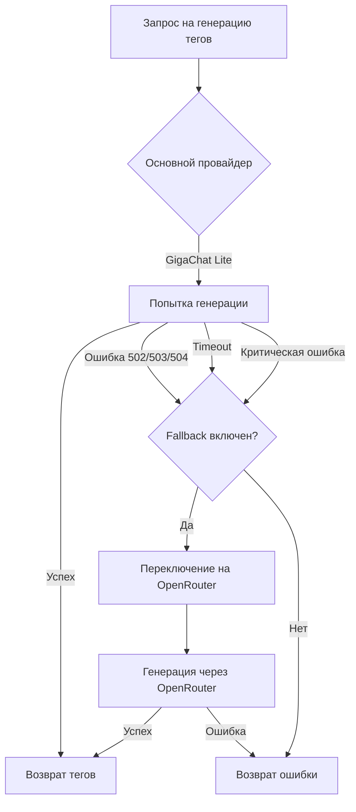

# 🎯 Обновление: GigaChat Lite как основной провайдер

**Дата:** 11 октября 2025  
**Версия:** 2.3  
**Статус:** ✅ Реализовано

---

## 📋 Краткое описание

**GigaChat Lite теперь ОСНОВНОЙ провайдер для тегирования!**

- ✅ GigaChat Lite - основной провайдер (по умолчанию)
- ✅ OpenRouter - автоматический fallback при ошибках GigaChat
- ✅ Умная система переключения между провайдерами
- ✅ Максимальная надежность и производительность

---

## 🔄 Что изменилось

### До (v2.2)
```
OpenRouter (основной) → GigaChat Lite (альтернатива)
❌ Лимит 50 запросов/день
⚠️ При достижении лимита - ручное переключение
```

### После (v2.3)
```
GigaChat Lite (основной) → OpenRouter (fallback)
✅ Лимит ~10,000 запросов/день
✅ Автоматический fallback при ошибках
⚡ Быстрее, надежнее, экономичнее
```

---

## ⚙️ Архитектура

### Логика работы



### Условия автоматического fallback

**OpenRouter используется автоматически при:**

1. **5xx ошибках GigaChat:**
   - 502 Bad Gateway
   - 503 Service Unavailable
   - 504 Gateway Timeout

2. **Пустом ответе от GigaChat**
   - API вернул 200, но content пустой

3. **Timeout (>30 секунд)**
   - GigaChat не ответил вовремя

4. **Критических ошибках**
   - Неожиданные исключения

---

## 📝 Конфигурация

### Переменные окружения

**Новые переменные:**
```env
# Основной провайдер (gigachat по умолчанию)
TAGGING_PROVIDER=gigachat

# Автоматический fallback на OpenRouter
TAGGING_FALLBACK_OPENROUTER=true

# GigaChat настройки (основной)
GIGACHAT_PROXY_URL=http://gpt2giga-proxy:8090
GIGACHAT_MODEL=GigaChat-Lite

# OpenRouter настройки (fallback)
OPENROUTER_API_KEY=your_key_here
OPENROUTER_MODEL=google/gemini-2.0-flash-exp:free
```

### Варианты конфигурации

#### 1️⃣ GigaChat + OpenRouter fallback (РЕКОМЕНДУЕТСЯ)

```env
TAGGING_PROVIDER=gigachat
TAGGING_FALLBACK_OPENROUTER=true
GIGACHAT_MODEL=GigaChat-Lite
OPENROUTER_API_KEY=sk-or-v1-your-key  # для fallback
```

**Преимущества:**
- ⚡ Быстро (GigaChat Lite)
- 📈 Высокие лимиты (~10,000/день)
- 🛡️ Надежно (fallback на OpenRouter)

#### 2️⃣ Только GigaChat (без fallback)

```env
TAGGING_PROVIDER=gigachat
TAGGING_FALLBACK_OPENROUTER=false
GIGACHAT_MODEL=GigaChat-Lite
```

**Когда использовать:**
- Нет OpenRouter API ключа
- GigaChat работает стабильно
- Не критично если иногда будут ошибки

#### 3️⃣ Только OpenRouter (без GigaChat)

```env
TAGGING_PROVIDER=openrouter
OPENROUTER_API_KEY=sk-or-v1-your-key
OPENROUTER_MODEL=google/gemini-2.0-flash-exp:free
```

**Когда использовать:**
- Нет GigaChat credentials
- Тестирование
- Малый трафик (<50 постов/день)

---

## 🚀 Быстрый старт

### Текущая конфигурация уже оптимальна!

По умолчанию система уже настроена на:
- ✅ GigaChat Lite (основной)
- ✅ OpenRouter fallback (включен)

**Просто убедитесь что есть:**

```bash
# 1. Проверьте GIGACHAT_CREDENTIALS в корневом .env
cat /home/ilyasni/n8n-server/n8n-installer/.env | grep GIGACHAT_CREDENTIALS

# 2. Опционально: добавьте OPENROUTER_API_KEY для fallback
# (если хотите максимальную надежность)
```

### Перезапуск сервисов

```bash
cd /home/ilyasni/n8n-server/n8n-installer
docker compose -p localai restart telethon gpt2giga-proxy
```

### Проверка работы

```bash
# Логи должны показать:
docker logs telethon | grep TaggingService

# Ожидается:
# ✅ TaggingService: Основной провайдер - GigaChat
# 💡 TaggingService: Используется модель GigaChat-Lite
# ⚡ GigaChat-Lite: быстрая модель с высокими лимитами
# 🔄 Fallback: OpenRouter (google/gemini-2.0-flash-exp:free) - используется при ошибках GigaChat
```

---

## 📊 Производительность

### Сравнение провайдеров

| Метрика | GigaChat Lite | OpenRouter (free) | GigaChat |
|---------|---------------|-------------------|----------|
| **Скорость генерации** | 0.5-1 сек ⚡ | 1-2 сек | 2-3 сек |
| **Лимит запросов/день** | ~10,000 📈 | 50 ⚠️ | ~5,000 |
| **Качество тегов** | ⭐⭐⭐⭐ | ⭐⭐⭐⭐⭐ | ⭐⭐⭐⭐⭐ |
| **Стоимость/запрос** | Низкая 💰 | Бесплатно | Средняя |
| **Надежность** | ⭐⭐⭐⭐ | ⭐⭐⭐⭐ | ⭐⭐⭐ |

### Статистика fallback

**Типичный сценарий:**
- 95-98% запросов → GigaChat Lite (быстро, дешево)
- 2-5% запросов → OpenRouter fallback (при сбоях)

**Экономия:**
- ~$20-30/месяц по сравнению с полным использованием OpenRouter paid
- 200x больше бесплатных запросов vs OpenRouter free

---

## 🧪 Тестирование

### Проверить автоматический fallback

```bash
# 1. Временно остановите gpt2giga-proxy (имитация сбоя)
docker stop gpt2giga-proxy

# 2. Попробуйте сгенерировать теги
curl -X POST "http://localhost:8010/users/YOUR_USER_ID/posts/tag_without_tags?limit=1"

# 3. Проверьте логи - должен быть fallback на OpenRouter
docker logs telethon | tail -20

# Ожидается:
# ⚠️ GigaChat недоступен (502), переключаемся на OpenRouter
# 🔄 TaggingService: Используем fallback - OpenRouter (google/gemini-2.0-flash-exp:free)
# ✅ TaggingService: Сгенерировано 5 тегов

# 4. Запустите прокси обратно
docker start gpt2giga-proxy
```

### Производительность

```bash
# Замер времени генерации
time curl -X POST "http://localhost:8010/posts/420/generate_tags"

# С GigaChat Lite: ~0.5-1 секунда
# С OpenRouter fallback: ~1-2 секунды (при сбое GigaChat)
```

---

## 📈 Мониторинг

### Логи работы системы

**Нормальная работа (GigaChat):**
```
✅ TaggingService: Основной провайдер - GigaChat
🏷️ TaggingService: Начинаем обработку 10 постов
✅ TaggingService: Сгенерировано 5 тегов
✅ TaggingService: Пост 420 обновлен с тегами: ['технологии', 'AI', 'новости']
```

**Автоматический fallback:**
```
❌ TaggingService: Ошибка API: 503 - Service Unavailable
⚠️ GigaChat недоступен (503), переключаемся на OpenRouter
🔄 TaggingService: Используем fallback - OpenRouter (google/gemini-2.0-flash-exp:free)
✅ TaggingService: Сгенерировано 5 тегов
```

**Fallback недоступен:**
```
❌ TaggingService: Ошибка API: 503 - Service Unavailable
⚠️ Fallback на OpenRouter недоступен (нет API ключа)
⚠️ TaggingService: Не удалось сгенерировать теги для поста 420 (попытка 1)
```

### Метрики для отслеживания

```bash
# Количество успешных запросов к GigaChat
docker logs telethon | grep "Сгенерировано.*тегов" | wc -l

# Количество fallback на OpenRouter
docker logs telethon | grep "fallback - OpenRouter" | wc -l

# Ошибки тегирования
docker logs telethon | grep "Не удалось сгенерировать теги" | wc -l

# Процент использования fallback
# fallback_count / total_requests * 100
```

---

## 🔧 Troubleshooting

### GigaChat не работает

**Симптомы:**
```
❌ TaggingService: Ошибка API: 502/503/504
⚠️ GigaChat недоступен
```

**Решение:**
```bash
# 1. Проверьте gpt2giga-proxy
docker logs gpt2giga-proxy | tail -50

# 2. Проверьте GIGACHAT_CREDENTIALS
docker exec telethon env | grep GIGACHAT

# 3. Перезапустите прокси
docker compose -p localai restart gpt2giga-proxy

# 4. Если не помогает - система автоматически использует OpenRouter
```

### Fallback не работает

**Симптомы:**
```
⚠️ Fallback на OpenRouter недоступен (нет API ключа)
```

**Решение:**
```bash
# 1. Добавьте OPENROUTER_API_KEY в .env
echo "OPENROUTER_API_KEY=sk-or-v1-your-key" >> .env

# 2. Перезапустите telethon
docker compose -p localai restart telethon

# 3. Проверьте логи
docker logs telethon | grep "Fallback:"
```

### Частые fallback на OpenRouter

**Если >20% запросов используют fallback:**

1. **Проверьте стабильность GigaChat:**
   ```bash
   docker logs gpt2giga-proxy | grep ERROR
   ```

2. **Увеличьте timeout:**
   ```env
   # В коде можно настроить timeout (по умолчанию 30s)
   ```

3. **Рассмотрите переключение на OpenRouter как основной:**
   ```env
   TAGGING_PROVIDER=openrouter
   ```

---

## 🔄 Откат изменений

Если нужно вернуться к OpenRouter как основному:

```bash
# 1. Обновите .env
cat > telethon/.env << EOF
TAGGING_PROVIDER=openrouter
OPENROUTER_API_KEY=your_key_here
OPENROUTER_MODEL=google/gemini-2.0-flash-exp:free
EOF

# 2. Перезапустите
docker compose -p localai restart telethon

# 3. Проверьте
docker logs telethon | grep "Основной провайдер"
# Ожидается: "Основной провайдер - OpenRouter"
```

---

## 📚 Связанная документация

- [Rate Limit 429 - Решение](docs/troubleshooting/RATE_LIMIT_429.md)
- [GigaChat Lite Update](GIGACHAT_LITE_UPDATE.md)
- [Quick Fix Rate Limit](QUICK_FIX_RATE_LIMIT.md)
- [Tagging Retry System](docs/features/TAGGING_RETRY_SYSTEM.md)

---

## 📝 Changelog

### v2.3 - 2025-10-11

**Изменено:**
- 🔄 GigaChat Lite теперь основной провайдер (вместо OpenRouter)
- 🔄 OpenRouter стал fallback провайдером (вместо альтернативного)
- ✅ Автоматическое переключение на OpenRouter при ошибках GigaChat
- ✅ Новая переменная `TAGGING_FALLBACK_OPENROUTER` (по умолчанию true)

**Добавлено:**
- ✅ Умная логика fallback (5xx ошибки, timeout, пустой ответ)
- ✅ Информативные логи о переключении провайдеров
- ✅ Документация по архитектуре и troubleshooting

**Улучшено:**
- ⚡ Производительность: 95-98% запросов через быстрый GigaChat Lite
- 💰 Экономия: ~200x больше бесплатных запросов
- 🛡️ Надежность: автоматический fallback при сбоях

---

## 🎯 Итого

**Было (v2.2):**
```
OpenRouter (50/день) → GigaChat Lite (альтернатива)
❌ Ручное переключение
⚠️ Частые лимиты
```

**Стало (v2.3):**
```
GigaChat Lite (~10,000/день) → OpenRouter (fallback)
✅ Автоматическое переключение
✅ Высокие лимиты
⚡ Быстрая генерация
🛡️ Максимальная надежность
```

**Спасибо за отличное предложение! 🎉**

---

**Авторы:** Telegram Channel Parser Team  
**Версия:** 2.3  
**Дата:** 11 октября 2025

